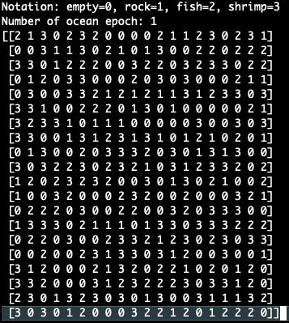
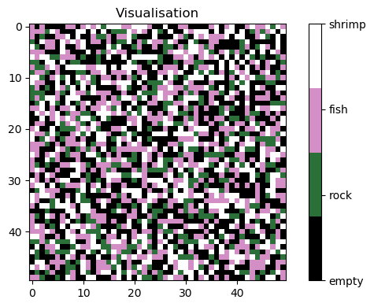

# Игра «Жизнь»

Задача взята [отсюда](https://gist.github.com/sslotin/fd88188025dfdca7ad8fb16157bde2ca).

Смоделирована экологическая система океана, в котором обитают рыбы и креветки.

Океан представляется двумерным массивом ячеек. Каждая ячейка может содержать:
* рыбу
* креветку
* скалу
* ничего

Все ячейки за границами игрового поля считаются пустыми. В каждый квант времени океан меняется, причем все ячейки меняют свое состояние одновременно.
Изменение ячеек происходит по определенным правилам:
* Ячейки со скалами не меняются во времени. 
* Если какой-то рыбе слишком тесно (у нее 4 и более соседей-рыб), либо слишком одиноко (меньше 2 соседей-рыб), то рыба погибает. 
* Если у рыбы 2 или 3 соседа-рыбы, то она просто продолжает жить. 
* Соседи-скалы и соседи-креветки никак не влияют на жизнь рыб. 
* Креветки существуют по аналогичным правилам. Рыбы на них не влияют.
* Если какая-то ячейка океана была пуста и имела ровно 3-х соседей рыб, то в следующий момент времени в ней рождается рыба. В противном случае, если у ячейки было ровно 
три соседа-креветки, в ней рождается креветка.

## Файлы репозитория

### `game_life.py`
Содержит все функции для симуляции океана, также содержит скрипт для запуска в консоли.


Выглядит следующим образом:


Симуляция длится до тех пор, пока океан не станет стационарным, т.е. перестанет изменяться.

В случае, если океан стал стационарен, то в консоль будут выведены вледующие сообщения:
```
'Ocean is fixed!'
'Application quits in next 5 seconds:'
```

Предупреждение, можно получить следующую ошибку:
```bash
Traceback (most recent call last):
  File "game_life.py", line 146, in <module>
    stdscr.addstr(1, 0, np.array2string(ocean))
_curses.error: addwstr() returned ERR
```
Связано с тем, что размеры терминала меньше, чем размеры отображаемого океана.

### `game_life.ipynb`
Ноутбук с визуализацией симуляции океана



Реализована возможность записать симуляцию океана в формате `.mp4`

